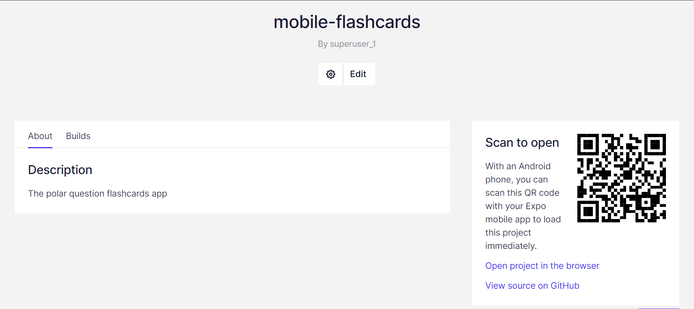
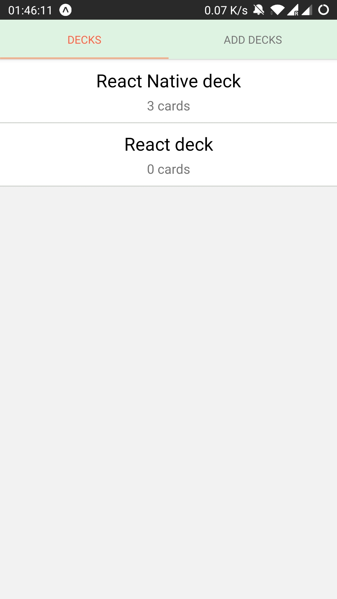
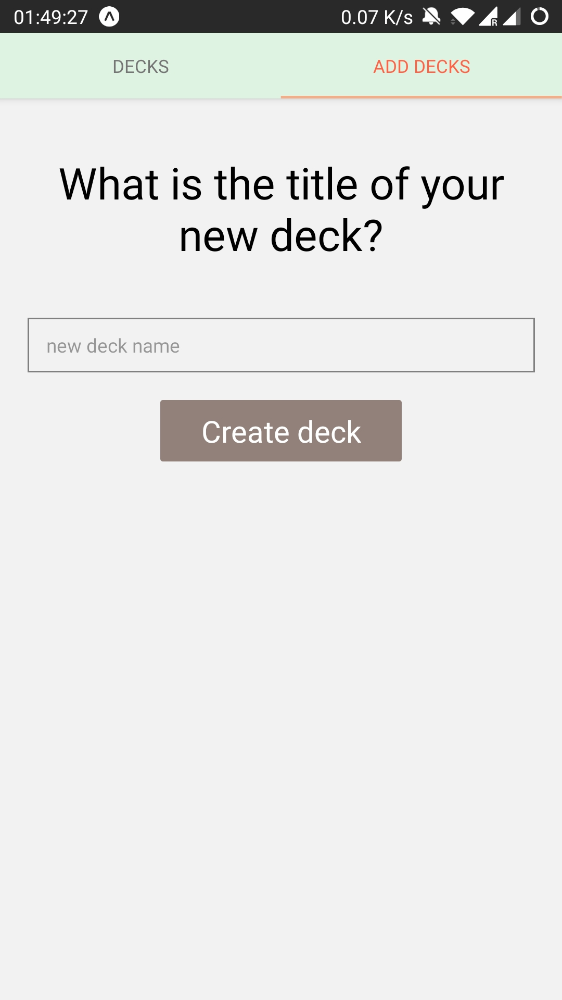
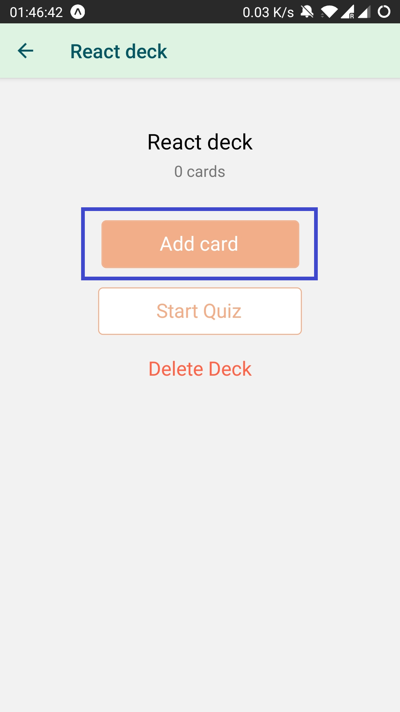

## Getting started

Mobile Flashcards is a React Native app that allows users to create decks, add cards, and quiz themselves. The app is built for the Android platform only.

### Requirements

This app is using Expo CLI. Assuming that you have [Node 12 LTS](https://nodejs.org/en/download/) or greater installed, you can use <code> npm </code> &ensp; or &ensp; <code> yarn </code> &ensp;to install the Expo CLI command line utility:

&ensp;&emsp;<code> npm install -g expo-cli </code>  
&ensp;&emsp;&ensp;&emsp;&ensp;&emsp;&ensp;&emsp;OR  
&ensp;&emsp;<code> yarn global add expo-cli </code>

Learn about building and deploying universal apps with [Expo](https://docs.expo.io/)

### Installation

Clone the repository

<code> git clone https://github.com/meghabalaraju/mobile-flashcards.git </code>

Install the dependencies from package.json

&ensp; <code>yarn install</code>  

Make sure to install the expo sdkVersion 39.0.0

To run this project in your local machine

&ensp; <code>yarn start</code>

### Demo

Remeber to install "Expo" app from [Google play store](https://play.google.com/store/apps/details?id=host.exp.exponent&referrer=www)

Access [project page](https://expo.io/@superuser_1/mobile-flashcards) and scan the QR code

Here you can see how the UI looks like for each functionality

 &ensp;  &ensp;  &ensp; 

## Functionalities

This app mainly has five view
- DeckList view
User can see all the decks list initialy. If there are no decks, view will be different.

- Create or Add deck view
Users can create a new deck. After the creation user will be taken to deck details view

- Deck details view
    - It contains deck title and how many cards are in that deck. 
    - User can add new card (question) to deck with help of "Add deck" button in the details view, which will take user to add deck view to take input from user for [polar          question](https://www.yourdictionary.com/polar-question).
    - User can take quiz in the deck details by pressing on the "Start quiz" button in the view which take user to quiz view
     - user can take a quiz themselves by going into quiz view with help of "Start quiz" button in the deck details view
    - user can delete the deck
- Quiz view
    - Question will be shown along with two options in the form of buttons for user to answer for the question. 
     -As well an answer button to pause the quiz an take a look at the answer for the current question
     - On quiz completion score will be shown to user which will be a percentage 

- User receives a notification if he has not taken quiz for the day.
