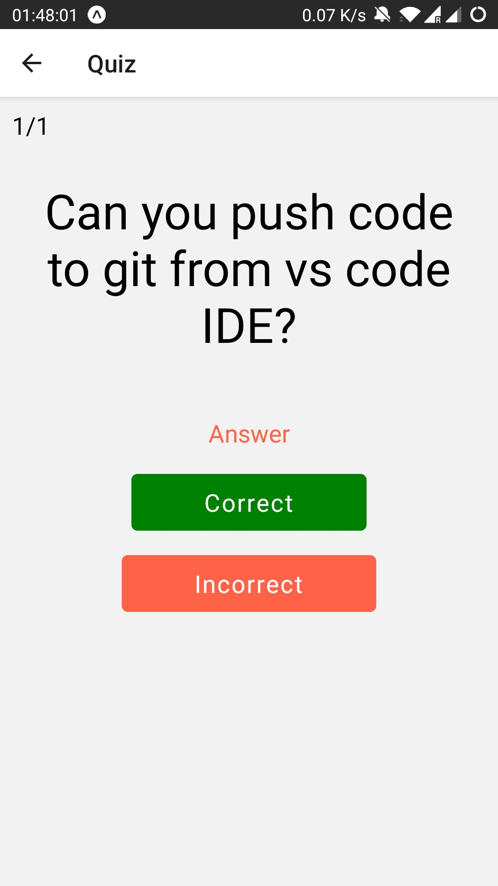

### Getting started

#### Description

Mobile Flashcards is a React Native app that allows users to create decks, add cards, and quiz themselves. The app is built for the Android platform only.

#### Requirements

This app is using Expo CLI. Assuming that you have [Node 12 LTS](https://nodejs.org/en/download/) or greater installed, you can use <code> npm </code> &ensp; or &ensp; <code> yarn </code> &ensp;to install the Expo CLI command line utility:

&ensp;&emsp;<code> npm install -g expo-cli </code>  
&ensp;&emsp;&ensp;&emsp;&ensp;&emsp;&ensp;&emsp;OR  
&ensp;&emsp;<code> yarn global add expo-cli </code>

Learn about building and deploying universal apps with [Expo](https://docs.expo.io/)

#### Installation

Clone the repository

<code> git clone https://github.com/meghabalaraju/mobile-flashcards.git </code>

Install the dependencies from package.json

&ensp; <code>yarn install</code>  

Make sure to install the expo sdkVersion 39.0.0

To run this project in your local machine

&ensp; <code>yarn start</code>

### Demo

Remeber to install "Expo" app from [Android](https://play.google.com/store/apps/details?id=host.exp.exponent&referrer=www)

Access [project page](https://expo.io/@superuser_1/mobile-flashcards) and scan the QR code

Here is a screen shot how project page looks like

## Functionalities

Here you can see how the UIlokks like for each functionality

User can see all the decks list initialy if there are no decks view will be different

Users can create a new deck

Add new card to deck

(add screenshot of )

Take quiz for themselves

User receives a notification if he has not taken quiz for the day.
